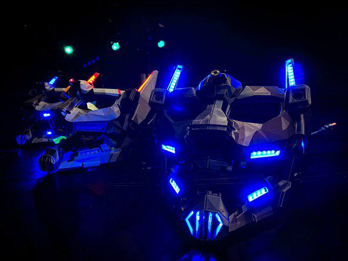

# Iron Skulls Mask - Azul Petróleo

Code and hardware repository for Iron Skulls Azul Petróleo Mask.

## Model

The mask can be 3D printed in two halves ([left](model/Mask_left.stl) and [right](model/Mask_right.stl)) with supports. Use at least 20% infill to avoid problems in the jaw connection. Both halves can be joined with M3 screws with inserts.

## Electronics

There are 45 addressable RGB LEDs (144led/m, skinny type from [Adafruit](https://www.adafruit.com/product/2969)), 2 very high power [white LEDs](https://www.adafruit.com/product/518) (discontinued?) and 1 [laser pointer](https://www.adafruit.com/product/1056). Everything is controlled by a Feather M0 board, with a RFM69 433MHz radio and powered by a 2000mAh LiPo battery. A shield is used to control the different elements. In addition, an [external antenna](https://www.mouser.es/ProductDetail/815-CAC053010-S433) is used for enhanced reach.

- RGB LEDs are powered directly from the battery, controlled with a single pin from the Feather
- The two high power LEDs are controlled via mosfet, in parallel. The LEDs neeed 3.3V, so a high power LDO is necessary
- The laser is controlled via PWM

A bill of materials is found in the [`hardware/controller`](hardware/controller) folder as well as pcb designs for the feather's shield. The kicad files say it's a Atmega 32u4, which can be, but better to use the Atmel SAMD21 (M0) for the extra Flash memory.

### Power

The feather handles battery charge via it's on board charger. The mask is charged via USB.
Since there are so many LEDs, **at least a 0.5C fast discharge rate battery** is necessary if everything is on. This means that the battery will last 2h at this discharge rate, otherwise, at 0.2C (normal rate), it will last 5h:

| Type | Ratio | Max. Current | Duration (theory) |
| -------- | -------- | -------- | -------- |
| Normal     | 0.2C     | 400mA     | 5h |
| Fast     | 0.5C     | 1A     | 2h |

The mask hasn't been tested for full power continuous operation for more than minutes, but it does last >6h in normal operation (not everything on at the same time, all the time).

## Control

The control follows a client-server architecture. Each mask is a server, with an address, and there is a client connected to a computer via USB. The code in both ends is _asynchronous_ so that messages can be sent and arrive to the masks at any time and be responsive.

### Client side

A python script listens to UDP messages and forwards them to a Feather M0 board via USB. This is the [Feather client code](radio/client) (platformio needed). This is the [python script](radio/bridge/bridge.py), using python AsyncIO for serial and OSC/UDP server.

### Server side

A similar code listens on the servers:

- Radiohead is used for receiving packets
- The RGB leds are managed using [NeoPixelBus](https://github.com/Makuna/NeoPixelBus)
- The two high power LEDs and the LED are managed using [JLED](https://github.com/jandelgado/jled)

Animations are static, triggered by a string received via radio, and are stored in [`Animations.h`](radio/server/src/Animations.h). There is a table for describing how the animations are encoded [here](radio/server/src/ANIMATIONS.md).